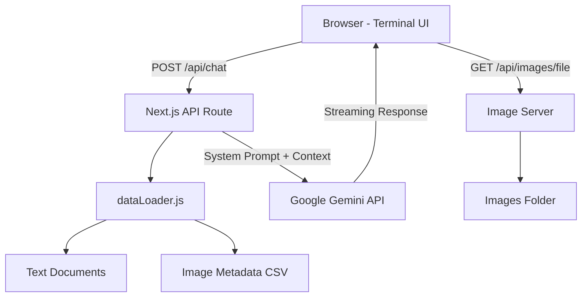
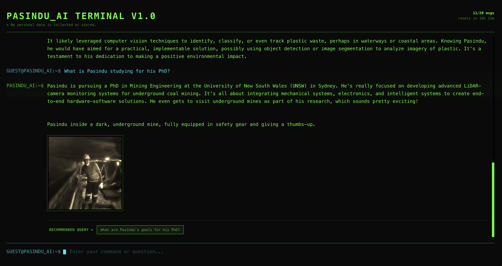

# Ask Me AI

*A retro terminal-style AI chatbot that lets people ask questions about you — powered by Google Gemini, your personal data, and cartoon-styled visuals.*

**[🔴 PLAY LIVE DEMO](https://ask-me-ai-beta.vercel.app/)**

---

## Features

- **Retro CRT Terminal UI** — Green-on-black terminal with scanline animations, blinking cursor, and monospace fonts
- **AI-Powered Conversations** — Real-time streamed responses via Google Gemini with a storytelling persona
- **Smart Image Integration** — AI picks and displays relevant images inline during chats
- **Personal Data Context** — Reads your text documents (`.txt`, `.md`, `.json`, `.docx`) and image metadata to give the AI context about you
- **Follow-Up Suggestions** — Suggests the next question to keep conversations flowing
- **Fully Responsive** — Works on desktop and mobile with adaptive terminal prompts

---

## How It Works



**Data Flow:**
1. User types a question in the terminal UI
2. The backend loads your personal text files and image metadata as context
3. Everything is sent to Gemini with a storytelling system prompt
4. The response streams back in real-time, with image tags rendered inline

---

## Getting Started

### Prerequisites

- **Node.js** 18+ and **npm**
- A **Google Gemini API Key** — [Get one here](https://aistudio.google.com/app/apikey)

### 1. Clone and Install

```bash
git clone https://github.com/maninka123/Ask-me-ai.git
cd Ask-me-ai
npm install
```

### 2. Configure Environment

```bash
cp .env.example .env.local
```

Edit `.env.local` and add your key:

```
GEMINI_API_KEY=your_actual_key_here
```

### 3. Add Your Data

| Path | What goes here |
|---|---|
| `data/Text data/` | Your `.txt`, `.md`, `.json`, or `.docx` files — the AI reads these as context |
| `data/Images/` | Your photos (served to the frontend). Folder name is configurable via `ai-config.json` |
| `data/image_metadata.csv` | Auto-generated by `analyze_images.py` |

### 4. Process Images

```bash
# Generate AI image metadata
pip install google-genai pandas
python3 data/analyze_images.py
```

### 5. Run

```bash
npm run dev
```

Open **http://localhost:3000** and start chatting.

---

## Project Structure

```
Ask-me-ai/
├── ai-config.json                         # Central configuration for persona & UI
├── src/
│   ├── app/
│   │   ├── page.js                        # Terminal UI
│   │   ├── layout.js                      # Root layout
│   │   ├── globals.css                    # CRT styling & animations
│   │   └── api/
│   │       ├── chat/route.js              # Gemini chat endpoint
│   │       └── images/[filename]/route.js # Image server
│   └── utils/
│       └── dataLoader.js                  # Loads personal data for AI context
├── data/
│   └── analyze_images.py                  # Gemini Vision metadata extractor
├── .env.example                           # Env template
└── package.json
```

---

## Tech Stack

| Tech | Role |
|---|---|
| Next.js 16 | Framework, API routes |
| Google Gemini 2.5 Flash | Conversational AI |
| Tailwind CSS 4 | Styling |
| Mammoth.js | `.docx` parsing |

---

## Customization

- **Configuration File** — Edit `ai-config.json` at the root of the project to change the person's name, pronouns, terminal text, AI persona, and tone.
- **Terminal colors** — Edit CSS variables in `src/app/globals.css`
- **Data sources** — Extend `src/utils/dataLoader.js` for new file types
- **Swap LLM** — Replace Gemini SDK calls with OpenAI, Anthropic, etc.

---

## Interface Preview



---

## License

MIT
